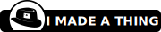

# Attribution etc. for tag images

## 

This tag image incorporates my personal hat logo, as tracked in [the stuartpb-brand repository](https://github.com/stuartpb/stuartpb-brand).

## 

This tag image incorporates [this](https://openclipart.org/detail/262254/grappling-hook) grappling hook illustration from OpenClipArt (which itself originally came from somewhere on Wikimedia Commons).

## 

This tag image uses [this](https://openclipart.org/detail/4155/glasses) Glasses illustration by "genu" on OpenClipArt.

## 

This tag image incorporates [the Flashlight emoji from EmojiOne 2.2.7](https://commons.wikimedia.org/wiki/File:Emojione_1F526.svg), licensed under the Creative Commons Attribution 4.0 International license. (Wikimedia Commons lists it as CC-BY-SA instead of CC-BY: this is [in error](https://github.com/emojione/emojione/blob/2.2.7/LICENSE.md).)

## 

This tag image incorporates [this](https://openclipart.org/detail/288591/linkable-gray-chain) "Linkable gray chain" from "tallmike" on OpenClipArt.

## 

The globe in this tag image is derived from ["crystal earth recycle"](https://openclipart.org/detail/2213/crystal-earth-recycle) by "kuba" on OpenClipArt.

## 

The glove in this tag image was originally patterned after Sonic the Hedgehog's glove, specifically from the Sonic Mania version of the *Sonic the Hedgehog* splash screen.

## 

The fish in this tag image started off patterned after the [Holy Mackerel](https://wiki.teamfortress.com/wiki/Holy_Mackerel) from TF2, since I wasn't satisfied with the best illustrations of fish I could find on OpenClipArt:

- https://openclipart.org/detail/252399/stylized-fish-silhouette-rotated
- https://openclipart.org/detail/524/jumping-fish
- https://openclipart.org/detail/518/fish

## 

This tag image incorporates [this](https://openclipart.org/detail/284808/running-icon) Running Icon from "Deluge" on OpenClipArt. 

## 

This tag image incorporates [the Flying Money emoji from EmojiOne 2.2.7](https://commons.wikimedia.org/wiki/File:Emojione_1F4B8.svg), licensed under the Creative Commons Attribution 4.0 International license. (Wikimedia Commons lists it as CC-BY-SA instead of CC-BY: this is [in error](https://github.com/emojione/emojione/blob/2.2.7/LICENSE.md).)